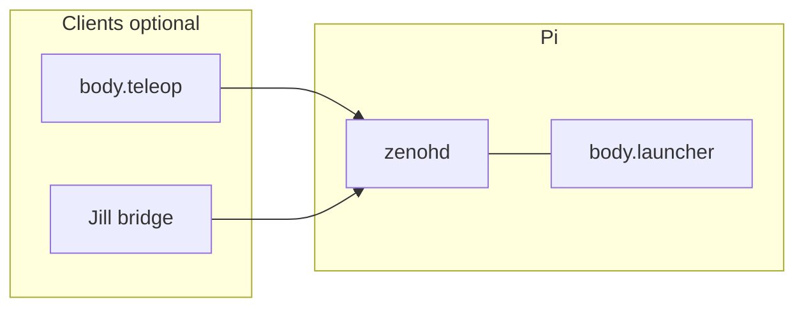

# Body

Onboard software for a differential-drive robot chassis: independent Python processes on a Raspberry Pi (target) communicate over [Zenoh](https://zenoh.io/) using JSON messages. The contract with the desktop agent (Jill / Cognitive Workbench) is defined in [body_project_spec.md](body_project_spec.md).

## Requirements

- Python 3.11+
- `eclipse-zenoh` and, for `oakd_driver`, `depthai` (see [requirements.txt](requirements.txt)); Linux udev rules for Movidius (`03e7`) are required to open the OAK from a non-root user.
- A Zenoh **router** (`zenohd`) reachable by every Body process and every client (teleop or Jill). On the robot, run the router on the Pi and listen on TCP **7447** (see [Configuration](#configuration)).

## Install (once per machine)

Use the **repository root** (the directory that contains `config.json` and the `body/` package—not the inner `body/` folder alone):

```bash
cd /path/to/Body
python3 -m venv .venv
.venv/bin/pip install -r requirements.txt
export PYTHONPATH="$(pwd)"
```

Use the same `PYTHONPATH` for `launcher`, `teleop`, and any `python -m body.*` command. The launcher also sets `PYTHONPATH` for child processes.

## Configuration

| Item | Purpose |
|------|---------|
| [config.json](config.json) | Zenoh `connect_endpoints`, motor/lidar/oakd/watchdog tuning. |
| `ZENOH_CONNECT` | Optional override: single endpoint, e.g. `tcp/192.168.1.50:7447`. Replaces `zenoh.connect_endpoints` for all processes. |

Router on the Pi (matches the spec): listen on `0.0.0.0:7447` so peers on the LAN can connect. Example `zenohd` config fragment:

```json
{
  "mode": "router",
  "listen": { "endpoints": ["tcp/0.0.0.0:7447"] }
}
```

Processes on the Pi should connect to **`tcp/127.0.0.1:7447`** (default in `config.json`). A laptop running teleop uses **`tcp/<pi-ip>:7447`** via `ZENOH_CONNECT` or edited `connect_endpoints`.

### Starting `zenohd` (router)

Body expects a **router** already running before you start `body.launcher` or `teleop`.

**`zenohd` is not installed by `pip` or your `.venv`.** The Python package `eclipse-zenoh` is only the client library. If the shell says `zenohd: command not found`, install the router binary below (or add it to your `PATH`).

1. **Install the router binary** on the machine that runs the router (usually the Pi). Pick one:
   - Official options: [Zenoh installation](https://zenoh.io/docs/getting-started/installation/).
   - **Raspberry Pi 5 (64-bit):** use the **aarch64 Linux standalone** archive from [eclipse-zenoh/zenoh releases](https://github.com/eclipse-zenoh/zenoh/releases). Unpack so `zenohd` and the bundled `*.so` plugins stay in the **same directory** (the archive layout is flat). Example (adjust `ZV` to match your `eclipse-zenoh` major.minor, e.g. `1.9.0`):

```bash
ZV=1.9.0
curl -sLO "https://github.com/eclipse-zenoh/zenoh/releases/download/${ZV}/zenoh-${ZV}-aarch64-unknown-linux-gnu-standalone.zip"
mkdir -p "$HOME/zenoh/${ZV}"
unzip -o "zenoh-${ZV}-aarch64-unknown-linux-gnu-standalone.zip" -d "$HOME/zenoh/${ZV}"
```

2. **Config:** This repo includes [deploy/zenohd-router.json](deploy/zenohd-router.json) — listens on **TCP `0.0.0.0:7447`**.

3. **Run** from the directory that contains `zenohd` (foreground; use `tmux` / `systemd` for production). Example if Body lives at `~/Body`:

```bash
"$HOME/zenoh/1.9.0/zenohd" -c "$HOME/Body/deploy/zenohd-router.json"
```

To put `zenohd` on your `PATH`, copy **both** `zenohd` and the `libzenoh_plugin_*.so` files into the same target directory (e.g. `$HOME/zenoh/1.9.0` already does), then:

```bash
export PATH="$HOME/zenoh/1.9.0:$PATH"
zenohd -c "$HOME/Body/deploy/zenohd-router.json"
```

If your `zenohd` build only accepts JSON5 configs, copy `zenohd-router.json` to `zenohd-router.json5` and pass that path.

4. **Check:** With `zenohd` running, start `body.launcher` on the Pi; processes should connect to `tcp/127.0.0.1:7447` per [config.json](config.json).

## Operation overview



1. Start **`zenohd`** on the Pi (or your dev box for all-local tests).
2. Start **`body.launcher`** on the Pi (motor, lidar, oakd, watchdog processes).
3. Optionally start **`body.teleop`** or a Jill-side bridge so **`body/heartbeat`** and **`body/cmd_vel`** are published. Without heartbeats, the watchdog will treat the robot as not under command and can trigger **`body/emergency_stop`**.

## Running the stack (`body.launcher`)

On the **Pi** (after `zenohd` is up):

```bash
cd /path/to/Body
export PYTHONPATH="$(pwd)"
.venv/bin/python -m body.launcher
```

Startup order: `watchdog` → `motor_controller` → `lidar_driver` → `oakd_driver`. Logs are prefixed by process name.

**Stop:** `Ctrl+C` or `SIGTERM` to the launcher; it sends `SIGTERM` to children, waits, then `SIGKILL` if needed.

**Restarts:** If a child exits unexpectedly, the launcher restarts it with exponential backoff (capped at 30 s).

**Deploy tip:** If errors reference old line numbers or missing symbols (e.g. `XLinkOut` on DepthAI v3), the Pi’s `~/Body` tree is behind your main repo—`git pull` or rsync the updated `body/` tree, then restart the launcher.

**Watchdog:** Until something publishes **`body/heartbeat`** (e.g. `body.teleop`), the watchdog may emit **`body/emergency_stop`** (`heartbeat_timeout`). That is expected; start teleop or another client when you want the stack to see a live operator.

## Standalone mode (no Jill)

**Standalone** means: Body processes on the Pi, and **you** provide heartbeat and velocity commands using the repo’s teleop client—Cognitive Workbench does not need to run.

### On the Pi

1. Start `zenohd`.
2. Start `body.launcher` as above.

### On the same Pi (keyboard / SSH session on robot)

```bash
cd /path/to/Body
export PYTHONPATH="$(pwd)"
.venv/bin/python -m body.teleop
```

Default `config.json` uses `tcp/127.0.0.1:7447`, which matches a local router.

### On a laptop / workstation (robot’s router on LAN)

Point Zenoh at the Pi:

```bash
cd /path/to/Body
export PYTHONPATH="$(pwd)"
export ZENOH_CONNECT=tcp/192.168.1.50:7447
.venv/bin/python -m body.teleop
```

(Replace the address with your Pi’s IP or hostname.)

### Teleop REPL

| Command | Meaning |
|---------|---------|
| `vel LINEAR [ANGULAR]` | Latch `body/cmd_vel`: linear m/s, angular rad/s (CCW positive). Angular defaults to `0`. |
| `stop` | Latch zero velocity. |
| `status` | Print last `body/status` JSON (if any). |
| `help` | Short help. |
| `quit` / `q` | Exit teleop (heartbeat and cmd_vel stop; robot may e-stop if nothing else publishes heartbeat). |

Optional flags: `--heartbeat-hz` (default 2), `--cmd-vel-hz` (default 20), `--timeout-ms` (default 500), `--verbose` (print every `body/status`).

**Motion authority:** Do **not** run teleop and another publisher (e.g. Jill) both commanding `body/cmd_vel` at the same time; the motor side effectively sees interleaved commands.

## Integration expectations (Jill / other agents)

Any desktop agent that embodies this robot should:

- Publish **`body/heartbeat`** at ≥ **2 Hz** while the robot is expected to accept motion.
- Publish **`body/cmd_vel`** often enough to satisfy the message **`timeout_ms`** (default **500 ms** in the spec) while moving or holding speed.
- Subscribe to `body/odom`, `body/lidar/scan`, `body/oakd/*`, `body/status`, `body/motor_state`, etc., as needed.

After a heartbeat fault, recovery follows **§5.10** in [body_project_spec.md](body_project_spec.md) (heartbeat back and a new `cmd_vel` path as implemented on the Pi).

## Smoke check (optional)

With the stack running, subscribe to `body/**` with Zenoh tooling (e.g. `zenoh-python` examples) and confirm traffic: `body/odom`, `body/lidar/scan`, `body/oakd/imu`, `body/status`, and—when teleop or Jill is active—`body/heartbeat` and `body/cmd_vel`.

## Layout

- [body/](body/) — package: `launcher`, drivers, `teleop`, `lib/` (`zenoh_helpers`, `schemas`, `diff_drive`).
- [deploy/](deploy/) — optional ops files (e.g. `zenohd-router.json`).

## License

See [LICENSE](LICENSE).
