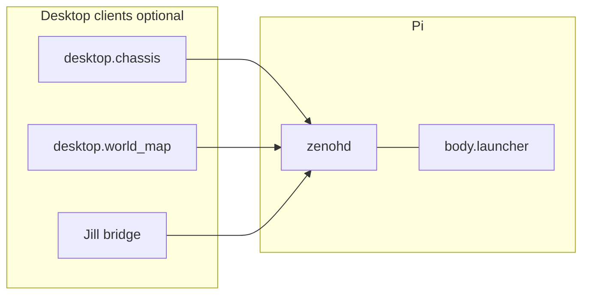

# Body

Differential-drive robot software in two halves that share one repo:

- **`body/`** — Pi-side runtime. Independent Python processes on a Raspberry Pi (target) communicate over [Zenoh](https://zenoh.io/) using JSON messages.
- **`desktop/`** — Operator-side stack (laptop / workstation). `chassis` is a low-level monitoring + manual command UI; `world_map` is a continuous world-frame fuser. Both connect to the Pi over the same Zenoh router.

The contract between the two halves — and with any external agent (Jill / Cognitive Workbench) — is defined in [docs/body_project_spec.md](docs/body_project_spec.md).

## Requirements

- Python 3.11+
- `eclipse-zenoh` and, for `oakd_driver`, `depthai` (see [requirements.txt](requirements.txt)); Linux udev rules for Movidius (`03e7`) are required to open the OAK from a non-root user.
- **OAK-D-Lite IMU:** retail units usually include a BNO IMU; DepthAI may require `oakd.imu_enable_firmware_update: true` (default in [config.json](config.json)) on first use. Some **Kickstarter OAK-D-Lite** boards have **no IMU** ([Luxonis docs](https://docs.luxonis.com/software-v3/depthai/depthai-components/nodes/imu/)) — set **`imu_hardware_present`: false** to run `oakd_driver` with synthetic `body/oakd/imu` so the launcher does not crash.
- A Zenoh **router** (`zenohd`) reachable by every Body process and every client (`desktop.chassis`, `desktop.world_map`, or Jill). On the robot, run the router on the Pi and listen on TCP **7447** (see [Configuration](#configuration)).
- Desktop side (`desktop/`) needs `PyQt6` + `requests`; see [desktop/requirements.txt](desktop/requirements.txt). Install only on machines that will run the operator UI — no need on the Pi.

## Install (once per machine)

Use the **repository root** (the directory that contains `config.json` and the `body/` package—not the inner `body/` folder alone):

```bash
cd /path/to/Body
python3 -m venv .venv --system-site-packages
.venv/bin/pip install -r requirements.txt
export PYTHONPATH="$(pwd)"
```

**Raspberry Pi + `motor.gpio_enabled`:** install **`python3-lgpio`** with apt (`sudo apt install python3-lgpio`). That package lives under the system interpreter’s `dist-packages`. A venv created **without** `--system-site-packages` cannot import `lgpio`, and `motor_controller` will fail at startup. Use **`--system-site-packages`** as above, or edit `.venv/pyvenv.cfg` and set `include-system-site-packages = true`, then retry.

**Raspberry Pi 5 PWM sysfs (non-root):** `motor_controller` uses RP1 hardware PWM via `/sys/class/pwm/...` (see [docs/motor_controller_spec.md](docs/motor_controller_spec.md) §4.6). Those attribute files are `root:root 0644` by default, so the launcher fails with `PermissionError` on `pwmchipN/pwmK/period` when run as a regular user. Install the shipped udev rule so members of `gpio` can write them:

```bash
sudo cp deploy/99-pwm.rules /etc/udev/rules.d/99-pwm.rules
sudo udevadm control --reload-rules
sudo udevadm trigger --subsystem-match=pwm
```

No reboot required. Verify with `ls -l /sys/class/pwm/pwmchip0/` — group should be `gpio`, mode `g+rw`. Ensure the launch user is in `gpio` (`groups`; add with `sudo usermod -aG gpio $USER` and re-login if not).

Use the same `PYTHONPATH` for `launcher` and any `python -m body.*` command. The launcher also sets `PYTHONPATH` for child processes.

**Desktop install (laptop / workstation only):**

Use a separate venv from the Pi-side `.venv`. Pi and desktop have non-overlapping needs (depthai/lgpio are Pi-only; PyQt6 is desktop-only), and the Pi venv typically uses `--system-site-packages` for lgpio while the desktop one does not.

```bash
cd /path/to/Body
python3 -m venv desktop/.venv
desktop/.venv/bin/pip install -r desktop/requirements.txt
export PYTHONPATH="$(pwd)"
```

`PYTHONPATH` must point at the **repo root** (not `desktop/`) so both `body.*` and `desktop.*` packages import. No `--system-site-packages` needed on the desktop side.

## Configuration

| Item | Purpose |
|------|---------|
| [config.json](config.json) | Zenoh `connect_endpoints`, motor/lidar/oakd/watchdog tuning. |
| `ZENOH_CONNECT` | Optional override: single endpoint, e.g. `tcp/192.168.1.50:7447`. Replaces `zenoh.connect_endpoints` for all processes. |

Router on the Pi (matches the spec): listen on `0.0.0.0:7447` so peers on the LAN can connect. Example `zenohd` config fragment:

```json
{
  "mode": "router",
  "listen": { "endpoints": ["tcp/0.0.0.0:7447"] }
}
```

Processes on the Pi should connect to **`tcp/127.0.0.1:7447`** (default in `config.json`). A laptop running `desktop.chassis` or `desktop.world_map` uses **`tcp/<pi-ip>:7447`** via `ZENOH_CONNECT` or edited `connect_endpoints`.

### Starting `zenohd` (router)

Body expects a **router** already running before you start `body.launcher` or any desktop client.

**`zenohd` is not installed by `pip` or your `.venv`.** The Python package `eclipse-zenoh` is only the client library. If the shell says `zenohd: command not found`, install the router binary below (or add it to your `PATH`).

1. **Install the router binary** on the machine that runs the router (usually the Pi). Pick one:
   - Official options: [Zenoh installation](https://zenoh.io/docs/getting-started/installation/).
   - **Raspberry Pi 5 (64-bit):** use the **aarch64 Linux standalone** archive from [eclipse-zenoh/zenoh releases](https://github.com/eclipse-zenoh/zenoh/releases). Unpack so `zenohd` and the bundled `*.so` plugins stay in the **same directory** (the archive layout is flat). Example (adjust `ZV` to match your `eclipse-zenoh` major.minor, e.g. `1.9.0`):

```bash
ZV=1.9.0
curl -sLO "https://github.com/eclipse-zenoh/zenoh/releases/download/${ZV}/zenoh-${ZV}-aarch64-unknown-linux-gnu-standalone.zip"
mkdir -p "$HOME/zenoh/${ZV}"
unzip -o "zenoh-${ZV}-aarch64-unknown-linux-gnu-standalone.zip" -d "$HOME/zenoh/${ZV}"
```

2. **Config:** This repo includes [deploy/zenohd-router.json](deploy/zenohd-router.json) — listens on **TCP `0.0.0.0:7447`**.

3. **Run** from the directory that contains `zenohd` (foreground; use `tmux` / `systemd` for production). Example if Body lives at `~/Body`:

```bash
"$HOME/zenoh/1.9.0/zenohd" -c "$HOME/Body/deploy/zenohd-router.json"
```

To put `zenohd` on your `PATH`, copy **both** `zenohd` and the `libzenoh_plugin_*.so` files into the same target directory (e.g. `$HOME/zenoh/1.9.0` already does), then:

```bash
export PATH="$HOME/zenoh/1.9.0:$PATH"
zenohd -c "$HOME/Body/deploy/zenohd-router.json"
```

If your `zenohd` build only accepts JSON5 configs, copy `zenohd-router.json` to `zenohd-router.json5` and pass that path.

4. **Check:** With `zenohd` running, start `body.launcher` on the Pi; processes should connect to `tcp/127.0.0.1:7447` per [config.json](config.json).

## Operation overview



1. Start **`zenohd`** on the Pi (or your dev box for all-local tests).
2. Start **`body.launcher`** on the Pi (motor, lidar, oakd, watchdog processes).
3. Optionally start **`desktop.chassis`** (or a Jill-side bridge) on a laptop so **`body/heartbeat`** and **`body/cmd_vel`** are published. Without heartbeats, the watchdog will treat the robot as not under command and can trigger **`body/emergency_stop`**.
4. Optionally start **`desktop.world_map`** on the same or another laptop to fuse `body/map/local_2p5d` + `body/odom` into a continuous world map (see [docs/world_map_spec.md](docs/world_map_spec.md)). Consumer-only; safe to run alongside `chassis`.

## Running the stack (`body.launcher`)

On the **Pi** (after `zenohd` is up):

```bash
cd /path/to/Body
export PYTHONPATH="$(pwd)"
.venv/bin/python -m body.launcher
```

Startup order: `watchdog` → `motor_controller` → `lidar_driver` → `oakd_driver`. Logs are prefixed by process name.

**Stop:** `Ctrl+C` or `SIGTERM` to the launcher; it sends `SIGTERM` to children, waits, then `SIGKILL` if needed.

**Restarts:** If a child exits unexpectedly, the launcher restarts it with exponential backoff (capped at 30 s).

**Deploy tip:** If errors reference old line numbers or missing symbols (e.g. `XLinkOut` on DepthAI v3), the Pi’s `~/Body` tree is behind your main repo—`git pull` or rsync the updated `body/` tree, then restart the launcher.

**Watchdog:** Until something publishes **`body/heartbeat`** (e.g. `desktop.chassis` with Live cmd enabled), the watchdog may emit **`body/emergency_stop`** (`heartbeat_timeout`). That is expected; start a desktop client when you want the stack to see a live operator.

## Standalone mode (no Jill)

**Standalone** means: Body processes on the Pi, and **you** provide heartbeat and velocity commands using `desktop.chassis` — no Cognitive Workbench / agent needs to run.

### On the Pi

1. Start `zenohd`.
2. Start `body.launcher` as above.

### On a laptop / workstation (robot’s router on LAN)

```bash
cd /path/to/Body
export PYTHONPATH="$(pwd)"
export ZENOH_CONNECT=tcp/192.168.1.50:7447
desktop/.venv/bin/python -m desktop.chassis
```

(Replace the address with your Pi’s IP or hostname; flags `--router`, `--heartbeat-hz`, `--map-stale-s`, `-v` are available — see `python -m desktop.chassis --help`.)

`chassis` opens a PyQt6 window with docks for camera, lidar, local map, motor test, vision, and a sweep-360 calibration mission. Heartbeat + `cmd_vel` are published while the **Live cmd** checkbox is on; toggle off to release motion authority without quitting.

### Optional: world_map fuser

```bash
desktop/.venv/bin/python -m desktop.world_map
```

Consumer-only — does not publish heartbeat or cmd_vel. Safe to run alongside `chassis`. See [docs/world_map_spec.md](docs/world_map_spec.md).

**Motion authority:** Do **not** run `chassis` (with Live cmd on) and another publisher (e.g. Jill) both commanding `body/cmd_vel` at the same time; the motor side effectively sees interleaved commands.

## Integration expectations (Jill / other agents)

Any desktop agent that embodies this robot should:

- Publish **`body/heartbeat`** at ≥ **2 Hz** while the robot is expected to accept motion.
- Publish **`body/cmd_vel`** often enough to satisfy the message **`timeout_ms`** (default **500 ms** in the spec) while moving or holding speed.
- Subscribe to `body/odom`, `body/lidar/scan`, `body/oakd/*`, `body/status`, `body/motor_state`, etc., as needed.

After a heartbeat fault, recovery follows **§5.10** in [docs/body_project_spec.md](docs/body_project_spec.md) (heartbeat back and a new `cmd_vel` path as implemented on the Pi).

## Smoke check (optional)

With the stack running, subscribe to `body/**` with Zenoh tooling (e.g. `zenoh-python` examples) and confirm traffic: `body/odom`, `body/lidar/scan`, `body/oakd/imu`, `body/status`, and—when `chassis` or Jill is active—`body/heartbeat` and `body/cmd_vel`.

## Layout

- [body/](body/) — Pi-side package: `launcher`, drivers (`motor_controller`, `lidar_driver`, `oakd_driver`, `watchdog`), `local_map`, `lib/` (`zenoh_helpers`, `schemas`, `diff_drive`).
- [desktop/](desktop/) — operator-side packages: [`chassis`](desktop/chassis) (low-level monitoring + manual command UI), [`world_map`](desktop/world_map) (world-frame fuser), `vision_service.py` (VLM client), `utils/` (shared helpers). A higher-level navigation UI (`nav`) is planned but not yet present.
- [deploy/](deploy/) — optional ops files (e.g. `zenohd-router.json`).

## License

See [LICENSE](LICENSE).
