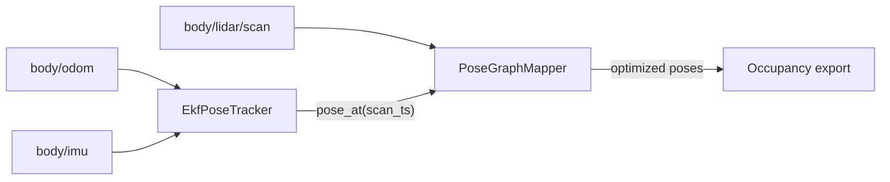

# SLAM & Map Architecture (2026)

Navigation uses a **two-phase map-and-localize** design:

| Phase | Entry | Output |
|-------|--------|--------|
| Mapping | `desktop/.venv/bin/python -m desktop.mapping` | `reference_map.npz` (2D occupancy + likelihood field) |
| Navigation | `desktop/.venv/bin/python -m desktop.nav --map PATH` | MCL pose + static costmap |

**Environment:** Desktop tools use the venv at `desktop/.venv` (not the repo-root `.venv` used on the Pi). From the repo root:

```bash
export PYTHONPATH="$(pwd)"
desktop/.venv/bin/pip install -r desktop/requirements.txt   # once
desktop/.venv/bin/python -m desktop.mapping --router tcp/PI:7447
desktop/.venv/bin/python -m desktop.nav --router tcp/PI:7447 --map path/to/reference_map.npz
```

## Packages

- `desktop/reference_map/` — frozen map schema, load/save, legacy `layers.npz` converter
- `desktop/mapping/` — EKF + pose-graph SLAM during teleop mapping drives
- `desktop/fusion/` — shared EKF pose tracker and `config.json` fusion/slam loader
- `desktop/localization/` — MCL particle filter against a read-only reference map
- `desktop/nav/` — autonomy shell (planner, follower, safety); Pi `local_2p5d` stays body-frame only

## Mapping pipeline (EKF + pose graph)



**Phase 0 noise priors** (`α₁`, `α₃`, `α₄`, IMU σ) live in `config.json` → `fusion` and are documented in [noise_models.md](noise_models.md). **SLAM tuning** (`match_hz`, scan-match window, loop-closure radius) lives in `config.json` → `slam`.

During mapping:

1. **EkfPoseTracker** fuses IMU yaw (tight) with encoder forward motion (`ds` only, IMU-projected). Maintains `(x, y, θ)` covariance for diagnostics.
2. **PoseGraphMapper** (slam_toolbox pattern) rate-limits scans, scan-matches against a rolling **submap** of recent optimized nodes (not the live integrating grid), adds pose-graph nodes/edges, attempts **loop closure**, and runs sparse **SE(2) optimization**.
3. **Occupancy** is ray-cast **only from graph-optimized node poses** — never from raw EKF priors alone. Export via `reference_map.npz`.

The mapping UI status strip shows EKF Σ_xy, graph node count, and last scan-match improvement. Operator pose and trail share the optimized graph frame.

## Navigation fusion

During nav, the same **EkfPoseTracker** config drives MCL motion prediction between scan updates (replacing raw odom deltas). MCL scan likelihood uses the frozen reference map.

## Deprecated mapping path

`MappingPoseTracker` (direct log-odds integration at live EKF pose, no loop closure) was superseded by the pose-graph pipeline above and removed from the tree (2026-05-27).

## Manual verification (hallway)

1. Status: `heading: imu`, EKF Σ reasonable; graph nodes incrementing
2. Slow 360° spin: no red fan; arrow rotates with IMU
3. Corridor out-and-back: **single** wall lines; trail folds back
4. Save map → nav with `--map` + MCL converges on return leg

## Deprecated for nav

The online `WorldGrid` fusion loop (`FuserController`, dual particle filters, scan-match vs `block_votes`) is superseded for production navigation. It remains under `desktop/world_map/` for reference and migration tooling.

See the redesign plan in `.cursor/plans/` and the original critique in [bayesian_localization_redesign.md](bayesian_localization_redesign.md).

**Live progress (2026-05-22):** First post-cutover mapping shows much improved map stability; desktop UI/teleop lag is severe and needs profiling. See [ekf_pose_graph_slam_progress.md](ekf_pose_graph_slam_progress.md).
