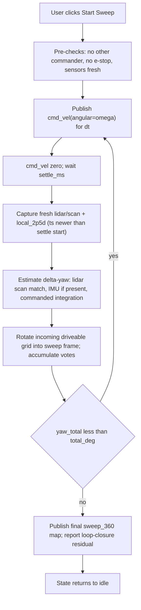

# Desktop sweep-360 driveable map — specification

**Version:** 0.1 draft
**Date:** 2026-04-21
**Audience:** Desktop implementers (the agent that already delivered [agent_desktop_stub_spec.md](agent_desktop_stub_spec.md)).
**Status:** Specification only — no Pi-side changes required.
**Normative references:**
[body_project_spec.md](body_project_spec.md) (wire contract + safety),
[agent_desktop_stub_spec.md](agent_desktop_stub_spec.md) (commanding-client discipline, depth/lidar consumption),
[local_map_spec.md](local_map_spec.md) (Pi-side driveable grid),
[desktop_change_spec_local_map.md](desktop_change_spec_local_map.md) (desktop consumption of `body/map/local_2p5d`).

---

## 1. Purpose

Add a desktop **mission** that commands the robot to rotate in place in discrete angular steps, observing the Pi-published `body/map/local_2p5d` after each step, and fuses the rotated egocentric grids into a single **360° driveable map** anchored at the robot's starting pose.

Goals:

- Produce a fused `max_height_m` + `driveable` grid covering the full ring around the robot, at the same cell resolution as `local_2p5d`.
- Recover the **actual yaw** each commanded step achieved (commanded ω is open-loop; drift is expected).
- Report a loop-closure residual at 360° as a quality gauge.
- Remain robust when the OAK-D has no IMU (the current hardware has confirmed no IMU chip).

Non-goals:

- Obstacle avoidance or path planning.
- Re-navigation back to the exact starting pose (nice to have, not required; see §10).
- Building maps beyond a single sweep (chaining / global mapping is a future extension, §10).

---

## 2. Where this runs

**Desktop**, as a sibling app to the operator console described in [agent_desktop_stub_spec.md](agent_desktop_stub_spec.md). Can be shipped as a tab in that console, a separate process sharing its Zenoh session, or an independent script — implementer's choice. No changes to the Pi-side `body/**` producers are required.

Rationale: this is an agent (closed loop from sensor reads to `cmd_vel`), not a driver. The Pi stack already runs at target CPU and `local_map` payload sizes; scan-matching and grid fusion belong on the laptop. See plan discussion in [plans/sweep360_app_analysis_*.plan.md].

---

## 3. Architecture



---

## 4. Wire contract

All JSON over Zenoh, same style as the rest of `body/**`. Three new topics live under `body/sweep/`.

### 4.1 `body/sweep/cmd` (any client → sweep app, inbound)

Request to start or abort a sweep. Fire-and-forget.

```json
{
  "action": "start",
  "step_deg": 30.0,
  "total_deg": 390.0,
  "angular_rate_dps": 30.0,
  "settle_ms": 1500,
  "direction": "ccw",
  "request_id": "b9f0..."
}
```

```json
{
  "action": "abort",
  "request_id": "b9f0..."
}
```

| Field | Type | Meaning |
|-------|------|---------|
| `action` | string | `"start"` or `"abort"`. Unknown actions ignored. |
| `step_deg` | number | Degrees commanded per rotation step. Default **30.0**. |
| `total_deg` | number | Total degrees to sweep. Default **390.0** (360° plus one overlap step for loop closure). |
| `angular_rate_dps` | number | Commanded angular rate during rotation, deg/s. Default **30.0**. Must map to `body/cmd_vel.angular` within `motor.max_wheel_vel_ms` implied limit. |
| `settle_ms` | number | Milliseconds to hold zero velocity after each step before capturing sensors. Default **1500**. |
| `direction` | string | `"ccw"` (angular positive, robot body convention) or `"cw"`. Default `"ccw"`. |
| `request_id` | string | Optional, echoed in `body/sweep/status`. |

Ignore unknown fields.

### 4.2 `body/sweep/status` (sweep app → bus, ~2 Hz while non-idle, plus transitions)

```json
{
  "ts": 1713264000.123,
  "state": "rotating",
  "request_id": "b9f0...",
  "step_index": 4,
  "step_count": 13,
  "yaw_accum_deg": 120.3,
  "coverage_deg": 120.3,
  "last_step": {
    "commanded_deg": 30.0,
    "yaw_sources": { "lidar": 29.7, "imu": null, "cmd": 30.0 },
    "fused_deg": 29.7,
    "residual_xy_m": [0.012, -0.004],
    "settle_ms": 1500
  },
  "loop_closure_deg": null,
  "reason": null
}
```

| Field | Type | Meaning |
|-------|------|---------|
| `state` | string | One of `idle`, `precheck`, `rotating`, `settling`, `fusing`, `done`, `aborted`, `estop`, `error`. |
| `request_id` | string? | Echo of the initiating `sweep/cmd`. |
| `step_index`, `step_count` | int | Progress. `step_count` ≈ `ceil(total_deg / step_deg)`. |
| `yaw_accum_deg` | number | Fused yaw accumulated since sweep start. |
| `coverage_deg` | number | Angular coverage achieved; equals `yaw_accum_deg` during a clean sweep. |
| `last_step.yaw_sources` | object | Per-source estimates for the most recent step. Each value is degrees or JSON `null` when unavailable. Keys: `lidar`, `imu`, `cmd`. |
| `last_step.fused_deg` | number | The value actually applied when rotating the incoming grid. |
| `last_step.residual_xy_m` | [number, number] | Scan-match translation residual in sweep frame (x, y) for the most recent step. Near zero for ideal in-place rotation. |
| `loop_closure_deg` | number? | Populated when `state` becomes `done`: residual between first and last scans after `total_deg` of accumulated rotation. |
| `reason` | string? | Populated for `aborted` / `estop` / `error`. Free-form, short. |

Cadence: publish on every state transition, and at ≥ 2 Hz while any non-idle state is active.

### 4.3 `body/map/sweep_360` (sweep app → bus)

Same JSON shape as `body/map/local_2p5d` from `schemas.local_map_2p5d` in [body/lib/schemas.py](../body/lib/schemas.py), with three additions:

```json
{
  "ts": 1713264000.123,
  "frame": "sweep",
  "kind": "max_height_grid",
  "resolution_m": 0.08,
  "origin_x_m": -2.5,
  "origin_y_m": -2.5,
  "nx": 63,
  "ny": 63,
  "max_height_m": [[null, 0.12, ...], ...],
  "driveable": [[null, true, ...], ...],
  "driveable_clearance_height_m": 0.35,
  "anchor_pose": { "x_m": 0.0, "y_m": 0.0, "theta_rad": 0.0 },
  "step_count": 13,
  "loop_closure_deg": -0.42,
  "request_id": "b9f0..."
}
```

Additions vs. `local_2p5d`:

- `frame` is `"sweep"` (not `"body"`). World-ish, anchored at the pose where `sweep/cmd action=start` was accepted.
- `anchor_pose` records that pose in whatever frame the app chose; when odometry is trusted it is `body/odom` at start, otherwise identity.
- `step_count`, `loop_closure_deg`, `request_id` are reporting conveniences.

Cadence:

- **Incremental** publishes encouraged every `fuse_publish_every_n_steps` steps (default **1** — after every fusion). Each incremental publish carries the current accumulator state; downstream consumers render it like `local_2p5d`.
- **Final** publish on `state = done` with `loop_closure_deg` populated.

Ignore unknown fields on consume (forward-compatible).

### 4.4 Motion traffic (existing topics)

While any non-idle state is active, the sweep app IS the commanding client per [agent_desktop_stub_spec.md](agent_desktop_stub_spec.md) §4.0:

- `body/heartbeat`: publish at ≥ **2 Hz** from `state = precheck` until `state = done | aborted | estop | error`.
- `body/cmd_vel`: publish at **10–20 Hz**.
  - During `rotating`: `{"linear": 0.0, "angular": ±rate_rad_s, "timeout_ms": 500}`.
  - During `settling`, `fusing`, `precheck`: `{"linear": 0.0, "angular": 0.0, "timeout_ms": 500}`.
- `body/cmd_direct`: **never published by this app**.

Before starting, the app SHOULD verify no other publisher is currently emitting `body/cmd_vel` or `body/heartbeat` (observe for ≥ 1 s). If either is seen, refuse to start and return `state = error` with `reason = "another_commander_active"`. See §7.

---

## 5. Inputs consumed

All existing `body/**` topics; no Pi changes.

| Topic | Role | Required? |
|-------|------|-----------|
| `body/map/local_2p5d` | Primary fusion source. Per-cell `max_height_m` + `driveable`. | Yes |
| `body/lidar/scan` | Primary yaw calibration (scan matching); secondary coverage check. | Yes |
| `body/oakd/imu` | Secondary yaw (orientation quaternion if present, gyro integration otherwise). Tolerate synthetic / absent. | No |
| `body/odom` | Tertiary yaw; translation prior between steps when encoders are online. Today: commanded-velocity playback, still usable as a sanity check. | No |
| `body/status` | Gate on `e_stop_active`; detect Pi process health. | Yes |
| `body/emergency_stop` | Abort trigger. | Yes |
| `body/cmd_vel` (own) | Optional echo to detect another commander. | No but recommended |

---

## 6. Algorithm

### 6.1 Step control

- Compute `step_count = ceil(total_deg / step_deg)` and `rate_rad_s = radians(angular_rate_dps)`.
- Rotation duration per step: `t_step = radians(step_deg) / rate_rad_s` (seconds).
- Sequence per step:
  1. `state = rotating`. Publish `cmd_vel(angular = ±rate_rad_s)` for `t_step`, then `cmd_vel(angular = 0)`.
  2. `state = settling`. Wait `settle_ms` with zero `cmd_vel`. Settle budget must accommodate one full lidar revolution (`scan_time_ms`) plus ≥ one Pi `local_map` publish period (≥ `1 / local_map.publish_hz`).
  3. `state = fusing`. Discard any lidar scan whose `ts < settle_started_ts + (scan_time_ms / 1000)` — those were captured while the robot was still rotating and have angular smear. Use the first scan whose `ts` is strictly after that threshold as the post-settle scan. Similarly use the first `local_2p5d` whose `sources.lidar_ts` is post-settle.
  4. Estimate yaw per §6.2 and fuse per §6.3.
- On completion, compute loop-closure residual per §6.4 and publish final map.

### 6.2 Yaw estimation (per step)

Fuse up to three sources into a single `fused_deg`. Each source returns a value in degrees or `None`.

1. **Lidar scan match (primary).** Input: pre-step scan and post-settle scan from `body/lidar/scan`. Two acceptable implementations:
   - **Angular cross-correlation (recommended for v1):** convert each scan to a 1-D range vector indexed by angle, compute circular cross-correlation, take the argmax as Δθ. Robust when range texture exists; fails gracefully (low peak-to-mean ratio → `None`) in featureless rooms.
   - **2-D ICP:** convert to Cartesian, run point-to-point ICP; recovers Δθ plus translation residual `residual_xy_m`. Higher cost, more general; prefer once v1 works.
   In either case, report `last_step.residual_xy_m` as zero if the method did not estimate translation.
2. **IMU orientation (secondary).** If `body/oakd/imu` carries `orientation` (BNO fused quaternion), compute Δyaw from pre- vs post-step quaternions via the z-axis component. If no `orientation` but gyro is present, integrate `gyro.z` over the rotation window. Today's hardware (no IMU) makes this source `None` — see [config.json](../config.json) `oakd.imu_hardware_present: false`.
3. **Commanded integration (tertiary / bootstrap).** Always available: `cmd = radians_to_degrees(rate_rad_s * t_step) * sign(direction)`. Use as bootstrap and as the "at-least-this" fallback.

**Fusion rule:**

- If `lidar` is present and its confidence metric (e.g. normalized correlation peak) ≥ threshold: `fused_deg = lidar`.
- Else if `imu` is present: `fused_deg = imu`.
- Else: `fused_deg = cmd`.

Report all three in `last_step.yaw_sources`. Do not silently overwrite with commanded; downstream debugging depends on the per-source breakdown.

### 6.3 Grid fusion

The accumulator is a fixed square grid in the **sweep frame** at the same `resolution_m` as `local_2p5d`:

- Size: `nx_sweep = ny_sweep = 2 * ceil(max(local_2p5d.extent_*_m) / resolution_m)`. The Pi defaults to an asymmetric rectangle (`extent_forward_m=4.0`, `extent_back_m=0.25`, etc.); the accumulator is symmetric so rotations don't fall off.
- Per cell, maintain:
  - `max_height_m`: running max across all fused frames (reduces to same rule as Pi's per-cell max).
  - `clear_votes`, `block_votes`: integer counters.

Fusion step when a new `local_2p5d` arrives after settle, with `fused_deg` applied:

1. Build the rotation `R(θ_accum)` where `θ_accum` is the yaw accumulated so far (including this step).
2. For each target accumulator cell `(i, j)` with center `(x_s, y_s)` in the sweep frame:
   - Compute source cell in `local_2p5d` body frame: `(x_b, y_b) = R(-θ_accum) · (x_s - anchor_x, y_s - anchor_y)`.
   - Index into `local_2p5d.max_height_m` / `driveable` at the nearest source cell; skip if out of bounds.
3. Update:
   - `max_height_m[i][j] = max(existing, source.max_height_m)` (treat `null` on either side as "no sample").
   - If `source.driveable == True`: `clear_votes[i][j] += 1`.
   - If `source.driveable == False`: `block_votes[i][j] += 1`.
   - If `source.driveable is None`: no change.

Final driveable verdict per cell (for publish):

- `True` if `clear_votes > block_votes + margin` (default `margin = 1`).
- `False` if `block_votes > clear_votes + margin`.
- `None` otherwise.

`driveable_clearance_height_m` is copied from the most recent incoming `local_2p5d`.

### 6.4 Loop closure

After `yaw_accum_deg` reaches `total_deg`, re-run the yaw estimator between the first captured scan (at `step_index = 0`) and the final post-settle scan. The result minus `total_deg` is `loop_closure_deg`. Publish it in `sweep/status.loop_closure_deg` on the `done` transition and inside the final `body/map/sweep_360`.

Do **not** back-distribute the error in v1. Reporting the residual is enough for the operator to judge quality; back-distribution is a v1.1 stretch (§10).

---

## 7. Safety & commanding-client discipline

- **Single-commander.** Refuse to start if `body/cmd_vel` or `body/heartbeat` from another publisher has been observed in the last 1 s. The operator console should **disable Live command** before starting a sweep (same discipline as `agent_desktop_stub_spec.md` §4.0).
- **Heartbeat ownership.** The sweep app publishes `body/heartbeat` ≥ 2 Hz for the entire non-idle duration. On `done` / `aborted` / `estop` / `error`, stop publishing heartbeat and `cmd_vel` within 100 ms.
- **E-stop.** On receipt of `body/emergency_stop` or any `body/status` with `e_stop_active: true`, immediately:
  1. Publish `cmd_vel(linear=0, angular=0)` once.
  2. Transition to `state = estop`.
  3. Preserve the accumulator (do not discard partial sweep).
  4. Do **not** auto-resume. Require a fresh `sweep/cmd action=start` to continue, matching the explicit re-engagement rule in [body_project_spec.md](body_project_spec.md) §5.10. For v1, a new start re-runs from scratch rather than resuming — resuming is a v1.1 stretch.
- **Abort.** `sweep/cmd action=abort` transitions to `state = aborted` within 200 ms and stops publishing motion.
- **Stale sensors.** If `body/lidar/scan` has not advanced in `max(scan_time_ms * 3, 500 ms)` at the point of fusion, fail the step with `state = error`, `reason = "stale_lidar"`. Same treatment for `local_2p5d` (use `local_map.publish_hz * 3` as the threshold).
- **Command limits.** Clamp `angular_rate_dps` such that `rate_rad_s * wheel_base_m / 2 ≤ motor.max_wheel_vel_ms`. Use values from the Pi `config.json` if available to the desktop (today: `max_wheel_vel_ms = 0.9`, `wheel_base_m = 0.190` → max ≈ **9.47 rad/s ≈ 543 dps**). The default 30 dps is comfortably safe.

---

## 8. Desktop configuration

No Pi config changes. Desktop-side defaults (implementer picks storage — dotfile, env, or UI):

| Knob | Default | Purpose |
|------|---------|---------|
| `zenoh_connect` | `tcp/<pi-ip>:7447` | Same endpoint the operator console uses. Respect `ZENOH_CONNECT`. |
| `step_deg` | 30.0 | §4.1. |
| `total_deg` | 390.0 | §4.1. Overlap of one step for loop closure. |
| `angular_rate_dps` | 30.0 | §4.1. |
| `settle_ms` | 1500 | §4.1. Must be ≥ lidar scan period + one `local_map` publish period. |
| `yaw_source_priority` | `["lidar", "imu", "cmd"]` | §6.2 fusion order. |
| `lidar_scanmatch_method` | `"correlation"` | `"correlation"` or `"icp"`. §6.2. |
| `lidar_scanmatch_min_confidence` | `0.35` | Normalized correlation peak. Below → fall through to next source. |
| `fuse_vote_margin` | 1 | §6.3. |
| `fuse_publish_every_n_steps` | 1 | §4.3. |
| `refuse_on_other_commander` | true | §7. |

---

## 9. Acceptance criteria

- [ ] Desktop connects to the Pi's Zenoh router; tolerates Wi-Fi jitter without crashing.
- [ ] `sweep/cmd action=start` with no other commander active produces a full sweep, fused accumulator, and a `done` status with `loop_closure_deg` populated (target: `|loop_closure_deg| < 2°` in a feature-rich room with lidar source).
- [ ] `sweep/cmd action=abort` during any non-idle state reaches `state = aborted` within 200 ms and zeros `cmd_vel`.
- [ ] Emergency stop during a sweep reaches `state = estop`, stops motion, and preserves the partial accumulator; a fresh `start` can be issued later.
- [ ] When `oakd.imu_hardware_present: false` on the Pi (today's unit), the app runs with `yaw_sources.imu = null` for every step and still completes sweep using `lidar` + `cmd`.
- [ ] `body/map/sweep_360` is shape-compatible with `body/map/local_2p5d` — the existing desktop viewer in [desktop_change_spec_local_map.md](desktop_change_spec_local_map.md) can render it without schema changes (subscribe to `body/map/**`).
- [ ] Refuses to start when another client is publishing `body/cmd_vel` or `body/heartbeat` within the last 1 s; `state = error`, `reason = "another_commander_active"`.
- [ ] `last_step.yaw_sources` always contains the three keys (`lidar`, `imu`, `cmd`) with either a number or `null` — never omitted.

---

## 10. Out-of-scope / deferred

- **Resume after e-stop.** v1 requires a fresh `start`; resuming a partial sweep is a v1.1 stretch.
- **Loop-closure error back-distribution.** v1 reports `loop_closure_deg`; v1.1 may distribute the residual evenly across steps before the final publish.
- **Encoder integration.** When `body/odom` transitions to real encoder integration, the app SHOULD add a fourth yaw source (encoder Δθ) and use `body/odom.x`, `body/odom.y` as a translation prior for the scan-match step. See plan discussion in [plans/sweep360_app_analysis_*.plan.md].
- **Return-to-start.** Optional post-sweep action that commands a short `cmd_vel` to null the residual yaw. Requires confident in-place yaw control; defer until encoders are live.
- **Chained sweeps.** Stitching multiple `sweep_360` maps captured at different anchor poses into a larger map is a future project — would need a world-frame rather than a per-sweep anchor. Pick this up once odometry is trustworthy.

---

## 11. References

- [body_project_spec.md](body_project_spec.md)
- [agent_desktop_stub_spec.md](agent_desktop_stub_spec.md)
- [local_map_spec.md](local_map_spec.md)
- [desktop_change_spec_local_map.md](desktop_change_spec_local_map.md)
- [body/lib/schemas.py](../body/lib/schemas.py)
